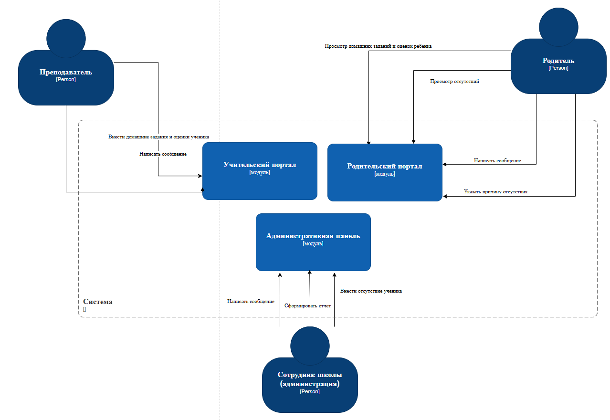

Система разделена на модули, каждый из которых обслуживает сценарии конкретной роли.

**Функциональная декомпозиция:**

-  Учительский портал (оценки, форум)

-  Родительский портал (просмотр успеваемости, ввод причин отсутствия, форум)

-  Административная панель (управление пользователями, генерация отчетов, настройки системы)

[plant-uml:./dekompoziciya-po-rolyam-polzovateley-2-y-variant.puml::590px:722px]

**Оценка модифицируемости:**

-  Высокая  для изменений, специфичных для роли

-  Средняя для изменений, затрагивающих несколько ролей

-  Средняя интеграции общих данных

{width=1278px height=880px}