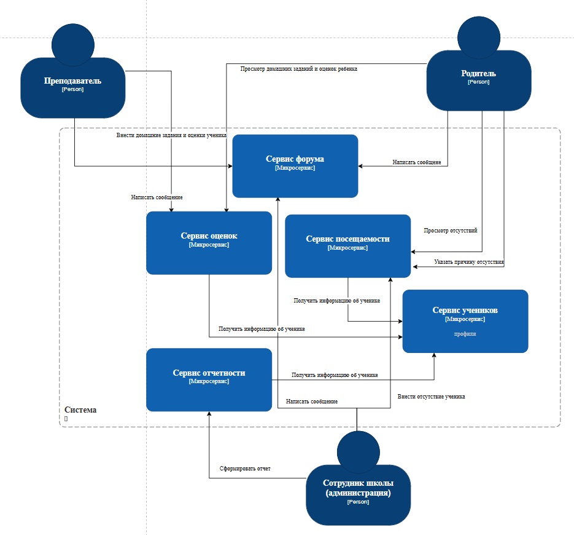

Система разделена на отдельные сервисы

**Функциональная декомпозиция:**

-  Сервис профилей (ученики, родители, сотрудники)

-  Сервис оценок

-  Сервис посещаемости (отсутствия, причины)

-  Сервис форума

-  Сервис отчетности

[plant-uml:./mikroservisnaya-arkhitektura-1-y-variant-dekompo.puml::1388px:334px]

**Оценка модифицируемости:**

-  Высокая для изменений внутри сервиса

-  Низкая для изменений, затрагивающих несколько сервисов

{width=935px height=870px}