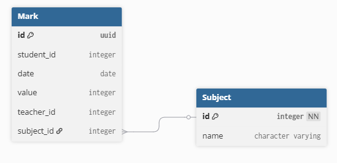
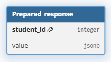

**Родители просматривают оценки  ребенка в час пик (вечер).**


Рассмотрим UC 1 : Родитель просматривает оценки ученика

**Оценка производительности:**

1. В данном варианте использования осуществляется обращение в два сервиса (понижается производительность относительно обращения в один сервис или работа внутри монолита).

2. В данном варианте использования осуществляется только чтение данных из БД

3. Резкий рост нагрузка на чтение БД повышает риск нарушения требования NFR-03 (Загрузка страницы не более 3-х секунд)

*Т.о. можем оценить производительность выше среднего*


**Оценка надежности:**

Поскольку вариант использования не предполагает изменения состояния системы (производится только чтение) , *то надежность можем оценить как высокую.*


**Оценка модифицируемости:**

При изменении модели данных одного из сервисов потребуется внесение изменений в оба сервиса (средняя модифицируемость).

Расширение сценария, например, обращением в новый сервис «Расписание» для обогащения ответа данными, также затронет изменение существующего сервиса оценок(средняя модифицируемость).

*Т.о. можем оценить модифицируемость как среднюю.*

[plant-uml:./kritichnyy-scenariy-1.puml::401px:677px]


Для повышения производительности предлагается использовать подход CQRS. Т.е. для запросов на получение оценок будет выделена отдельная база данных со своей схемой данных.

В сервисе оценок схема БД остаётся:

{width=551px height=267px}


В новой, выделенной БД - одна таблица, содержащая готовый ответ по каждому ученику (с учетом информации из сервиса профилей):

{width=222px height=125px}

в value - JSON следующей структуры:

```json
{
  "items": [
    {
      "value": 4,
      "date": "2026-02-06",
      "subject": "Название предмета",
      "teacher": "ФИО учителя"
    }
  ]
}
```


[plant-uml:./kritichnyy-scenariy.puml::538px:561px]


Для реализации данного сценария оптимизации так же будет необходимо внести изменение в "UC-2 «Внесение оценки учителем»

[plant-uml:./kritichnyy-scenariy-2.puml::393px:472px]


[plant-uml:./kritichnyy-scenariy-3.puml::919px:796px]


Данныы вариант оптимизации UC-2 предполагает создание нового сервиса обработки сообщений из очереди (функционал которого можно будет расширять для схожих ситуаций) для работы с БД «Prepared answer», что, вкупе с введением асинхронности, позволит не увеличивать нагрузку на сервис оценок. Однако, появляется риск снижения надежности системы из-за появления новых точек отказа.

Так же для UC-1 появляется риск снижения надежности, в части консистентности данных в случае, когда оценка уже проставлена и запрос от родителя идёт до записи новых данных в БД «Prepared answer». Данный риск можем считать незначительным, т.к. сценарий маловероятный и не критичный, а скорость обработки запросов увеличится.